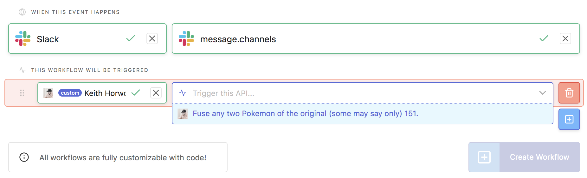
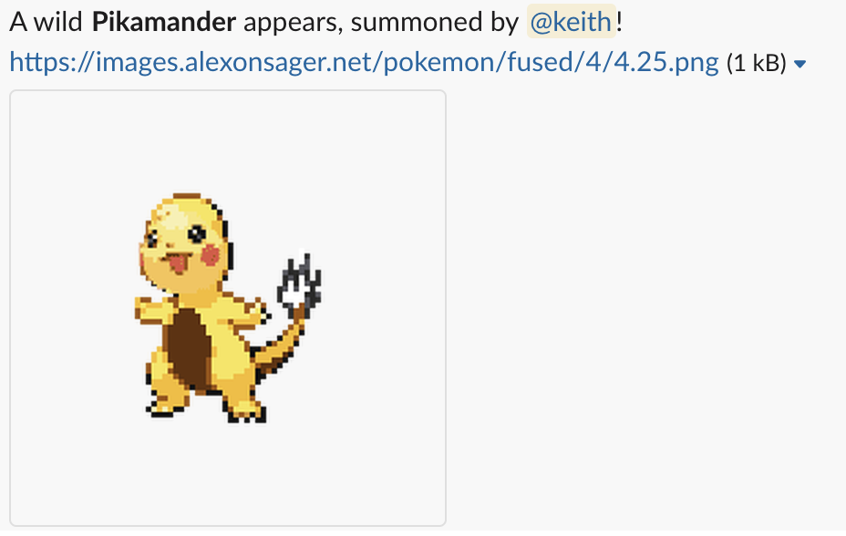
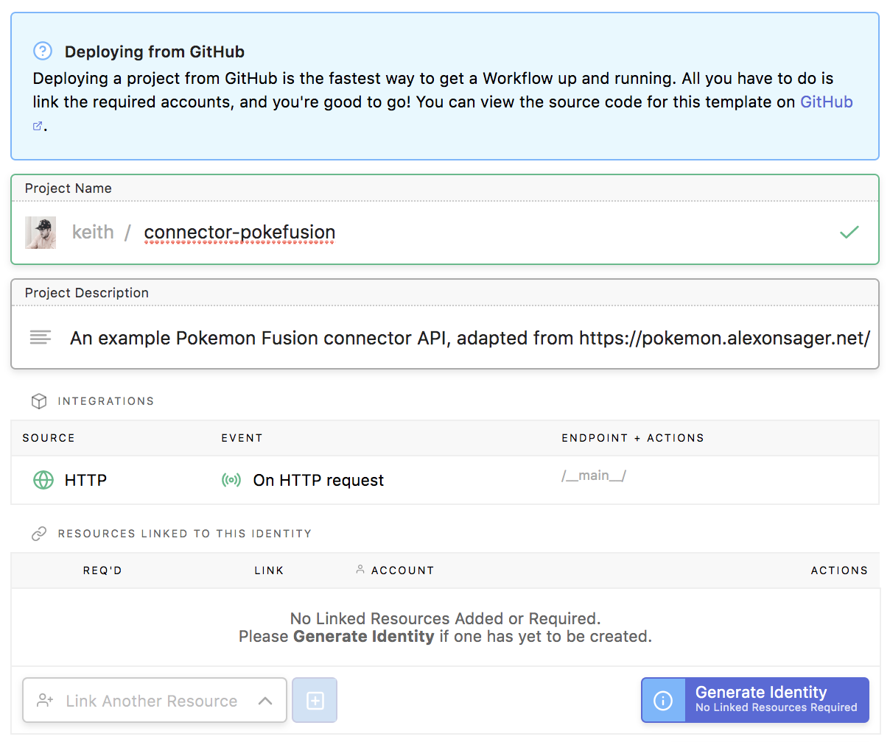
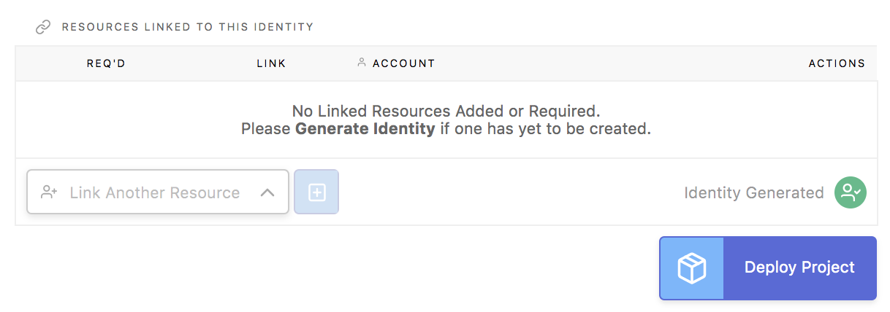
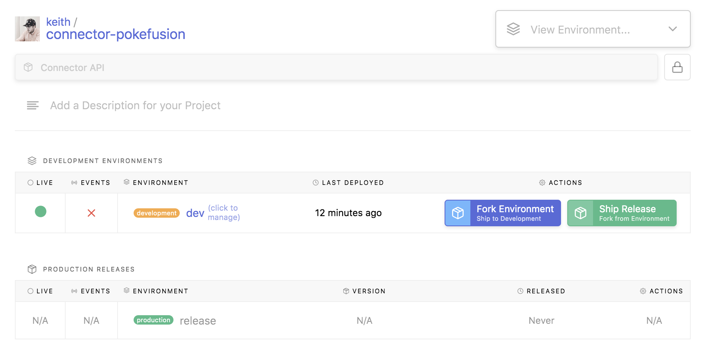
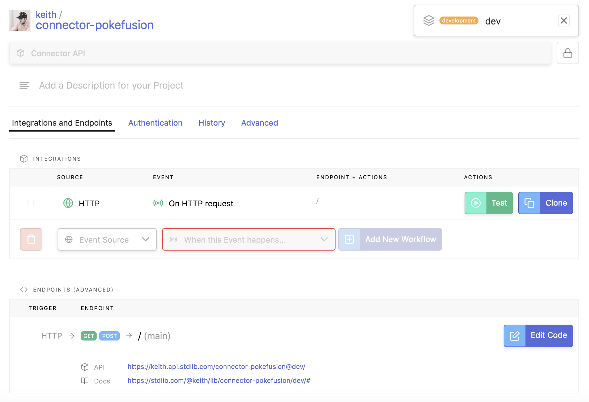
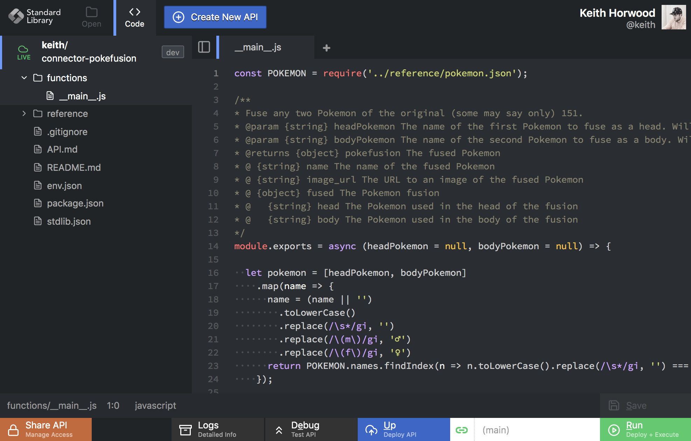
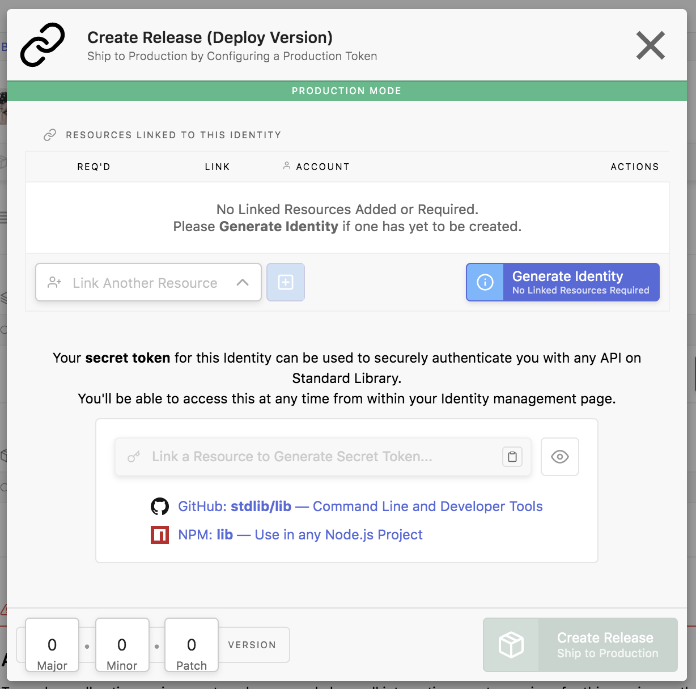
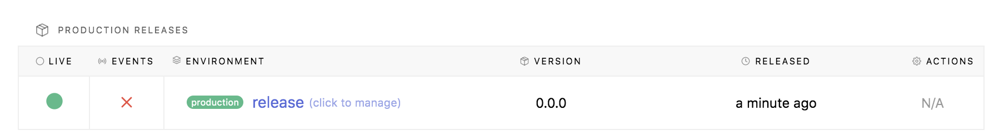

# Example: Pokefusion Connector API

Welcome to the Pokefusion Connector API Example! We'll use this repository as a basic template for creating
new **Connector APIs**, or APIs that appear as a part of the [Build on Standard Library](https://build.stdlib.com/)
user interface. As an example, once complete and shipped to production, your API will appear in the *actions* list.

Which we can use to build things like Slack workflows that produce output like:

## This README

This is the README for you API. It is intended to guide other developers on
**internal implementation** of your code, like how to set up a workflow project
or connector API. It **will not** be displayed in your
[Standard Library](https://stdlib.com/) documentation.

You can include an **Deploy to Build on Standard Library** button for GitHub,
as displayed above.

## About this API

This Pokefusion Connector API is a basic example of how to set up a Connector API
using [Build on Standard Library](https://build.stdlib.com). You can use this template
to deploy a basic Pokefusion API to your personal Standard Library account, which can
then be used as a part of the [Build on Standard Library](https://build.stdlib.com/)
interface on [build.stdlib.com](https://build.stdlib.com/).

This sample API has one endpoint, `__main__.js` which accepts two parameters, `headPokemon` and `bodyPokemon` for generating random fused Pokemon based on [pokemon.alexonsager.net](https://pokemon.alexonsager.net/).

## Deploying this Connector API

You can deploy this API instantly using the **Deploy on Standard Library** button:

From here, you'll be brought to a screen that looks like this:

Click **Generate Identity** to create an Identity Token for this API. This is a necessary step when deploying any Workflow or Connector APIs to Standard Library. This token securely stores API credentials and environment variables.

The bottom of the screen will then change to:

Click **Deploy Project** to proceed. That's it! You'll be forwarded to the project management page when the Connector is deployed. From here, you can edit individual endpoints or open the API on [Code on Standard Library](https://code.stdlib.com/) to edit the code that powers your API.

## Modifying this API

Once deployed, you'll be brought to a project management page that looks like this:

You can click **dev (click to manage)** to proceed to the endpoint summary for the dev environment you just deployed. You'll be brought to this screen:

To modify your API code, click on **Edit Code** in the bottom right of the screen next to the endpoint. This will open up your code in [Code on Standard Library](https://code.stdlib.com).

You can deploy updates to this code by clicking the **Blue *Up* Button** or **Green *Run* Button** after making modifications. It's that easy!

## Using this API

You can run this API at any time from either (1) [Code on Standard Library](https://code.stdlib.com),
or (2) the API reference page, available at `stdlib.com/@user/lib/pokefusion` (or whatever your
`@user` / `api-name` combination is, if not `pokefusion`).

**To add your Connector API to the Actions list**, simply **ship a release version** of your API.
To accomplish this, go back to your first API management screen, usually available at
`build.stdlib.com/projects/{user}/{api-name}` where `{user}` is your username and `{api-name}` is the API name,
in this case, likely `pokefusion`.

Click the **Green *Ship Release* Button**. You'll see this screen:

Click **Generate Identity**, then once complete, **Create Release**. Your management screen will refresh once complete.

Voila! Your release has been created. You can now head to [build.stdlib.com](https://build.stdlib.com), and search through available API actions. Your display name should be listed with your API:

You can now use this Connector API in projects!

## That's it!

Building Connector APIs is easy! We're excited to see what you build.

Thanks,
- Standard Library Team

